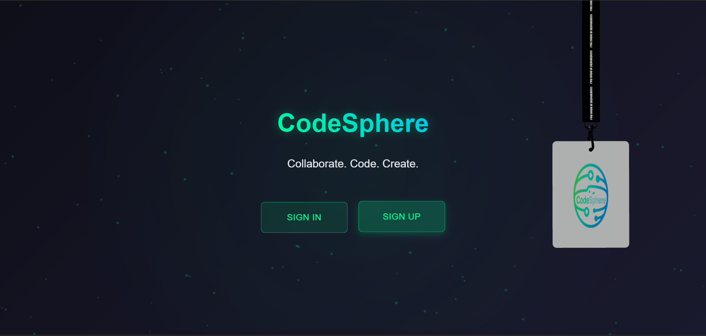

# 🚀 CodeSphere – Real-time Collaborative Coding Platform

**CodeSphere** is a real-time collaborative coding platform enabling developers to **code, chat, and collaborate seamlessly**.  
Teams can work together with **live-synced editors, multi-language support, project folders, version tracking, chat, and secure rooms**.  
The platform demonstrates **database CRUD operations, role based access, input validation, error handling, and a modern responsive UI**.  

---

## Implementation

### Roles & Authentication 
- Secure signup/login with **JWT authentication & bcrypt encryption**.  
- Session handling for authenticated access.  
- Role-based access (Viewer, Editor roles). 

### Frontend
- **React.js (v18.3.1)** with **Monaco Editor** for syntax highlighting.  
- **Tailwind CSS + Material UI** for modern, responsive UI.  
- Real-time sync powered by **Pusher.js**.  

### Backend & Database
- **Node.js + Express.js** backend.  
- **MongoDB with Mongoose** for persistence.  
- CRUD APIs for projects, files, users, and chat history.  
- **Piston API** for multi-language code execution. 

### Error Handling & Validation
- Prevents invalid inputs in signup, project/file creation.  
- Error handling with proper alerts & fallback responses.  
- Duplicate file/project prevention.  

---

### Workflow
- **Developers** → Create projects, add files, code collaboratively, chat in real-time.  
- **File Operations** → Save, download, or delete code files.  
- **Execution** → Run code, view terminal I/O, share results instantly.  
- **Collaboration** → Multiple users edit simultaneously with live cursors.  
- **Rooms** → Private room creation with unique IDs for secure access.  

## Results
- Real-time, multi-user code editing with live sync.  
- Secure authentication and role-based access.  
- Demonstrates **CRUD operations**, **validation**, and **error handling**.  
- Accurate code execution results and version tracking.  
- Enhanced with **chat system, file save/download**, and modern UI.  

---

## Features and Screenshots

### 1. User Authentication
- Secure **signup/login system**  
- JWT-based authentication  
- Session handling & encryption  




---

### 2. Room Management
- Create **private coding rooms**


- Share via unique room IDs  


- Quick access to recent rooms  


---

### 3. Real-time Code Collaboration
- Multi-user simultaneous editing  
- Live synchronization powered by WebSockets  
- Visual cursors & highlights for active users  


---

### 4. Code Execution
- Compile & execute code in real-time  
- Integrated **I/O terminal support**  
- Share execution results with teammates  


---

### 5. Multi-language Support
Currently supports **7 programming languages**:
- JavaScript (v18.15.0)  
- Python (v3.10.0)  
- Java (v15.0.2)  
- C (v10.2.0)  
- C++ (v10.2.0)  
- C# (v6.12.0)  
- Go (v1.16.2)  


---

### 6. Role-Based Access Control
- Role-based permissions  
- Users can have **Viewer**, **Editor** roles  
- Helps organize teamwork efficiently  


---

### 7. Integrated Chat System
- Built-in chat for instant communication  
- Collaborators can send messages in real-time  
- Stay connected without leaving the coding environment  


---

### 8. Project & File Management
- Create, save and delete files  
- Organized **project folder structure**  
- Automatic file extension handling  
- File version history for better tracking  


---

### 9. Download Option
- Users can instantly download their code files for offline use.


---

### 10. About Page
- A dedicated page introducing CodeSphere’s purpose, features, and team vision.


---

## 🎯 Getting Started

### 1️⃣ Clone the repository
```bash
git clone https://github.com/imrishu18/CodeSphere-Collaborative-Code-Sharing-Platform
```

### 2️⃣ Install dependencies
```bash
cd frontend
npm install   # Install frontend deps
cd backend
npm install   # Install backend deps
```

### 3️⃣ Start the servers
```bash
# Start frontend
cd frontend
npm start

# Start backend
cd backend
npm run dev
```

### 4️⃣ Open in browser
```
http://localhost:3000
```

## 👨‍💻 Author
- **Rishu Raj** – Developer of CodeSphere  
- 📧 Email: rishuraj1308@gmail.com  

> *Stay Innovative, Keep Collaborating, Build Smarter.* 🚀
